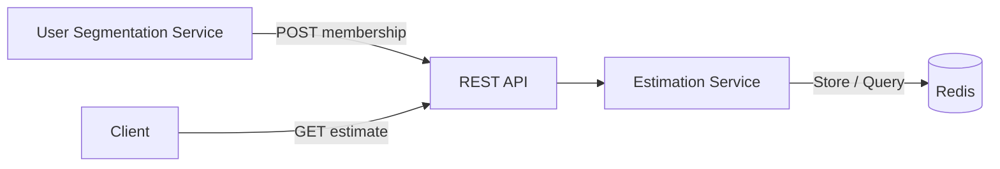

# Estimation Service

A Go implementation of the Estimation Service (ES) from the "How many users?" challenge.

The service receives `(user_id, segment)` memberships from a User Segmentation Service (USS), stores them, and estimates the number of currently active users in a segment.

Each membership remains active for 14 days. Repeated memberships refresh the expiration time.

## Overview

The implemented solution intentionally keeps the architecture simple while remaining scalable for the scope of this challenge.



Redis Sorted Sets are used to store memberships. The expiration timestamp is stored as the score, allowing active users to be counted efficiently without scanning all users.

### Production Architecture

The current implementation is the **simple architecture for this challenge**.

For a production environment with significantly higher traffic and scale, the recommended design is the production-ready architecture described in [`docs/architectures/production-ready-architecture.md`](docs/architectures/production-ready-architecture.md).

The production design introduces Kafka-based ingestion, horizontally scaled consumers, and Redis Cluster.

## API

### Store Membership

```bash
curl -X POST http://localhost:8080/v1/memberships \
  -H "Content-Type: application/json" \
  -d '{"user_id":"u104010","segment":"sports"}'
```

### Estimate Active Users

```bash
curl http://localhost:8080/v1/segments/sports/estimate
```

Example response:

```json
{
  "segment": "sports",
  "count": 123
}
```

### Health Check

```bash
curl http://localhost:8080/healthz
```

## Running Locally

### With Docker Compose

Start the application and Redis:

```bash
make docker-up
```

The service will be available at `http://localhost:8080`.

Stop the services:

```bash
make docker-down
```

### Run the Go Application Locally

Redis is started automatically by `make run`.

```bash
make run
```

## Testing

Run all tests:

```bash
make test
```

Run tests with the race detector:

```bash
make test-race
```

Run Redis integration tests:

```bash
make test-integration
```

Redis integration tests use the Redis instance started by Docker Compose. When Redis is not available, the integration tests are skipped in the general test suite.

## Project Structure

```text
cmd/
  api/                  Application entrypoint

internal/
  domain/               Domain models and business rules
  service/              Application/business logic
  storage/              Storage interface and implementations
  transport/http/       HTTP handlers and routing
  config/               Application configuration

docs/
  architectures/        Simple and production-ready architectures
  adr/                   Architecture Decision Records
```

## Design Documentation

Detailed implementation decisions are documented in:

* [`docs/implementation.md`](docs/implementation.md) - implementation choices and trade-offs
* [`docs/architectures/simple-architecture.md`](docs/architectures/simple-architecture.md) - implemented architecture
* [`docs/architectures/production-ready-architecture.md`](docs/architectures/production-ready-architecture.md) - production-scale architecture
* [`docs/adr/`](docs/adr/) - Architecture Decision Records

## Useful Commands

```bash
make help
make fmt
make lint
make build
make run
make test
make test-race
make test-integration
make docker-up
make docker-down
```
