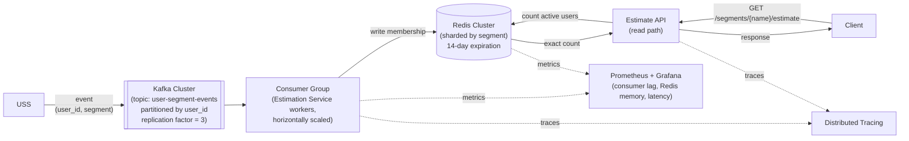
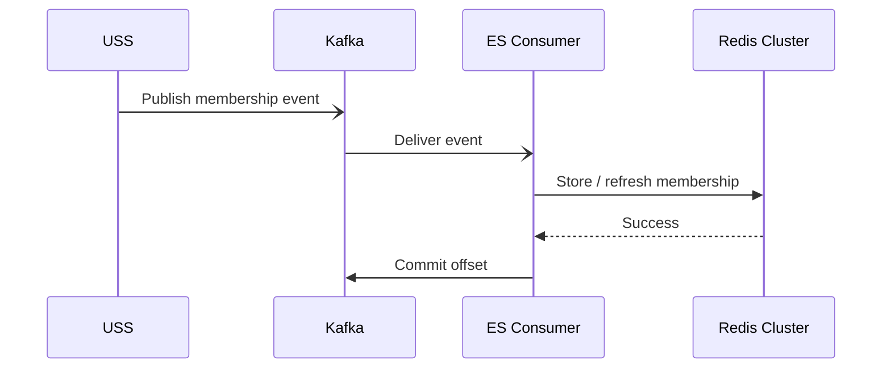
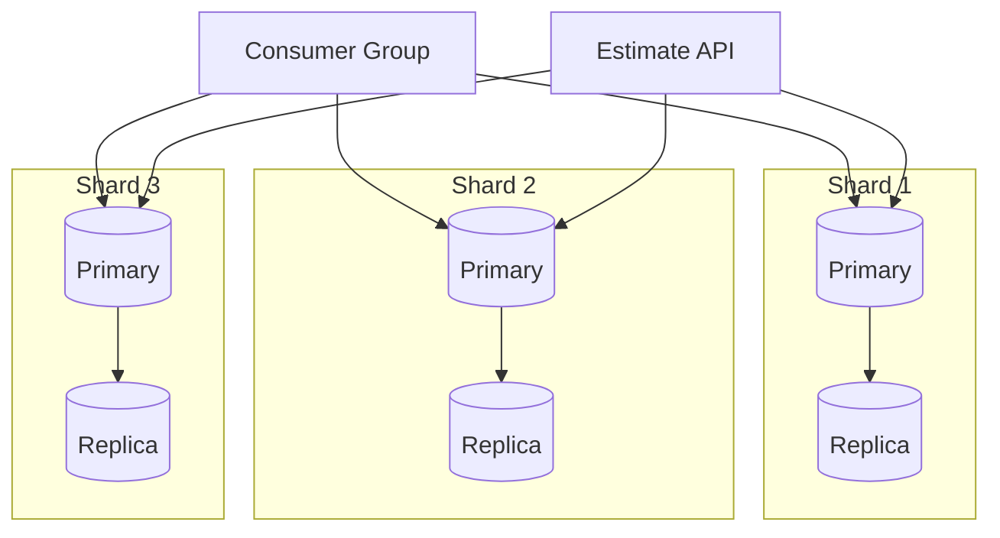

## Purpose

This document describes a production-ready architecture for the Estimation Service.

It focuses on handling high traffic, service failures, scaling, and reliable event processing while keeping the active user count accurate.

## Assumptions

- The service needs to handle millions of users and high traffic.
- USS sends membership events asynchronously through Kafka.
- Redis is used as the fast storage for active memberships.
- Kafka keeps the events so Redis can be rebuilt if needed.
- A membership stays active for 14 days.
- The same `(user_id, segment)` event refreshes the 14-day period.
- The count should be accurate, not approximate.

## High-Level Architecture



**Flow description:**
1. USS sends a membership event to Kafka.
2. Kafka stores and distributes the event to the ES consumer group.
3. An ES instance processes the event and updates Redis.
4. A client sends an estimate request to ES.
5. ES reads the current count from Redis and returns it.
6. Prometheus collects metrics and Grafana shows them.
7. Tracing helps track requests and events across the system.

## Components

**Kafka**
- Receives membership events from USS.
- Keeps events durable and lets us process them asynchronously.

**Estimation Service**
- Consumes events and updates Redis.
- Runs multiple instances so it can scale horizontally.
- Also handles estimate requests.

**Redis Cluster**
- Stores active memberships.
- Shards data by segment and supports fast counting.

**Estimate API**
- Handles client requests for the current count.
- Reads the data from Redis.

**Monitoring & Tracing**
- Prometheus collects metrics and Grafana shows them.
- Distributed tracing helps us follow requests and events across the system.

## Event Ingestion & Data Flow

- USS sends membership events to the `user-segment-events` Kafka topic.
- Events are partitioned by `user_id` to spread the load and keep events for the same user ordered.
- The topic uses a replication factor of `3` so events remain available if a Kafka broker fails.
- Estimation Service workers consume the topic as a consumer group.
- Multiple workers can run in parallel, which allows the ingestion layer to scale horizontally.
- Each event is processed and the related membership is written to Redis.
- Kafka keeps the events, so failed messages can be retried and the Redis data can be rebuilt if needed.

### Event Flow



## Storage, Sharding & Expiration

Redis Cluster is used as the serving store because the main operations are simple: update a membership and count active users in a segment.

### Redis Cluster & Sharding

The data is sharded by `segment`. This keeps all users of the same segment together and makes counting within a segment efficient.

Each shard has a primary node and replicas for high availability.



### Data Model

Each segment is stored as a Redis Sorted Set.

```text
segment:sports
    user-101 -> expiration_timestamp
    user-202 -> expiration_timestamp
    user-303 -> expiration_timestamp
```

- `member` is the `user_id`.
- `score` is the membership expiration timestamp.
- This lets us quickly count active users.

For example:

```text
ZCOUNT segment:sports <current_time> +inf
```
This returns the number of users whose membership is still active.

### Expiration Strategy

Each membership stays active for 14 days from the time the event is processed.

When the same `(user_id, segment)` is received again, its expiration timestamp is updated and the 14-day period starts again.

Expired memberships are ignored when calculating the count, so they do not need to be deleted immediately.

A background cleanup process can periodically remove expired members to keep Redis memory usage under control.

Kafka keeps the original events, so Redis can be rebuilt by replaying the events if needed.

## Consistency, Reliability & Scalability

### Consistency

The system is eventually consistent because membership events are processed asynchronously through Kafka.

There may be a short delay between receiving an event and seeing it in the estimate result. This is acceptable for this use case.

### Reliability & Failure Handling

Kafka keeps events until they are successfully processed. If an Estimation Service worker fails, another worker can continue processing the event.

Redis failures should not cause incorrect results. The service should return an error when the data is temporarily unavailable.

### Scalability

The Estimation Service workers can scale horizontally by increasing the number of consumers in the consumer group.

Kafka partitions allow events to be processed in parallel, while Redis Cluster allows the storage layer to scale horizontally.

### Availability

Kafka uses replication to keep events available if a broker fails.

Redis Cluster uses replicas so the service can continue working when a Redis node fails.

The service should also use health checks, timeouts, and graceful shutdown to handle failures safely.

### Durability & Recovery

Kafka acts as the durable event source.

If Redis data is lost, the service can replay Kafka events and rebuild the Redis data.

### Observability

Prometheus collects metrics such as request latency, error rate, Redis health, and Kafka consumer lag.

Grafana is used to monitor these metrics.

Distributed tracing helps follow requests and events across the system.
