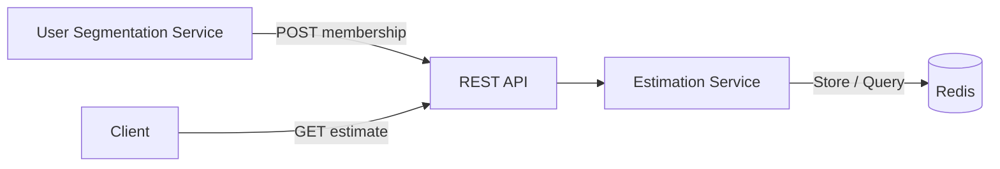

## Purpose

This document describes the simple architecture of the Estimation Service (ES).

The service receives `(user_id, segment)` memberships from USS, keeps each membership active for 14 days, and provides the number of active users in a given segment.

The architecture is simple and focuses on being easy to implement, test and understand.

## Scope

**In scope:**
- Receive `(user_id, segment)` events through a REST API
- Store memberships with a 14-day expiration
- Return the exact number of active users for a segment
- Run as a single service instance with a single Redis instance

**Out of scope:**
- High availability and fault tolerance
- Horizontal scaling for ingestion
- Message queues or buffering

## Assumptions

- The traffic is low enough for a single Redis instance to handle reads and writes.
- "Estimate" means an exact count in this version.
- A user can belong to multiple segments.
- Receiving the same `(user_id, segment)` again refreshes the 14-day expiration.
- Duplicate events are expected and are handled safely.

## High-Level Architecture

**Flow description:**
1. USS sends a `(user_id, segment)` membership to the REST API.
2. The Estimation Service stores the membership in Redis with a 14-day expiration.
3. A client sends a request to get the number of active users in a specific segment.
4. The Estimation Service queries Redis and returns the current count.

## Components

**REST API**
- Handles HTTP requests and validates the input.
- Passes requests to the Estimation Service.
- Contains no business logic.

**Estimation Service**
- Contains the core business logic.
- Exposes two main operations:
  - `Store(userID, segment)` — creates or refreshes a membership.
  - `Estimate(segment) -> int` — returns the number of active users.
- Depends on a `Storage` interface instead of Redis directly.

**Storage (Redis)**
- Implements the `Storage` interface.
- Stores user memberships and their expiration time.
- Uses Redis Sorted Sets to efficiently store and count active memberships.

**Why this structure?**
- Keeps business logic independent of HTTP and Redis.
- Makes the service easy to unit test with a fake storage.
- Allows us to replace REST or Redis later without changing the core logic.

## API Boundary

The service exposes two HTTP endpoints:

### Store Membership

`POST /v1/memberships`

Receives a `user_id` and `segment` from USS.

### Estimate Segment

`GET /v1/segments/{segment}/estimate`

Returns the current number of active users in the requested segment.

## Storage & Data Model

Redis is used as the storage layer. Each segment is stored as a Sorted Set, where:

- The member is the `user_id`.
- The score is the membership expiration timestamp.

For example:

`segment:sports -> { user-1: expiry-1, user-2: expiry-2 }`

This allows us to efficiently add or refresh memberships and count users whose expiration time has not passed.

## Expiration / 14-Day Membership

Each membership is valid for 14 days from the time it is received.

The expiration timestamp is stored as the score of the Redis Sorted Set. When the same `(user_id, segment)` is received again, its expiration time is updated to 14 days from the new event.

When counting users, only memberships with an expiration time greater than the current time are counted.

Expired memberships can be removed periodically as a cleanup step, but they do not need to be removed immediately for the count to be correct.

## Consistency Model

The simple architecture uses eventual consistency.

After USS sends a membership, the count may briefly lag behind the latest event while the data is being stored in Redis.

For this use case, a small delay is acceptable because the service is designed to provide an estimate rather than a strictly real-time count.

Within a single Redis instance, once the write is completed, subsequent reads will see the updated membership.

## Scalability, Reliability & Operations

- The current design is simple and assumes one service instance and one Redis instance are enough.
- If traffic grows, we can run more service instances and move Redis to a cluster.
- If Redis is unavailable, the service should return an error instead of returning a wrong count.
- In production, we would also add authentication, rate limiting, logs, metrics, and tracing.
- The main limitations are synchronous writes, no message queue, and no durable event history.
- These can later be improved with Kafka, Redis Cluster, and horizontal scaling.
